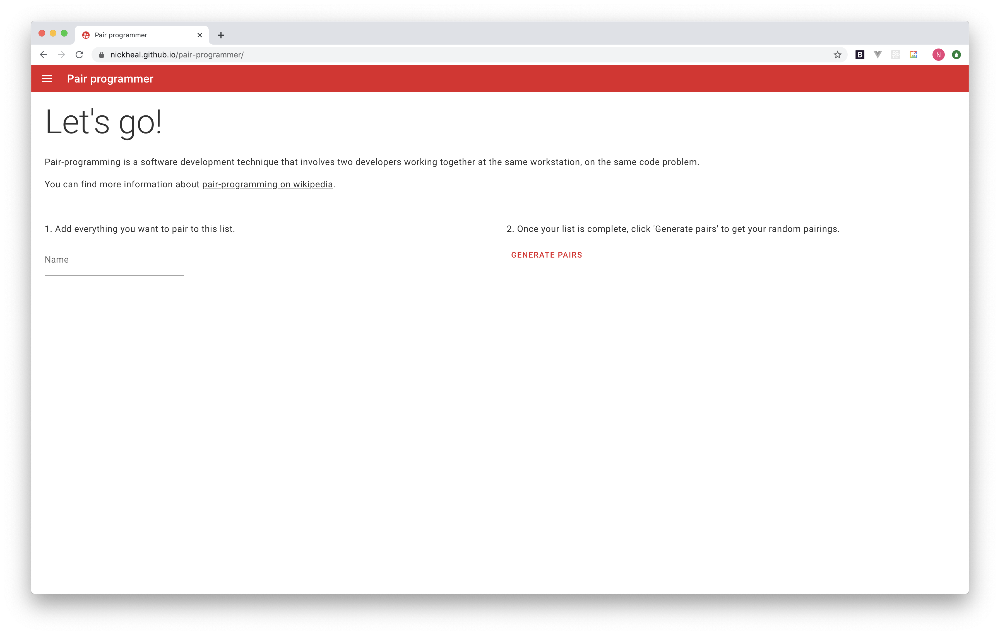

# Pair-programmer

Based on the [default Sapper template](https://github.com/sveltejs/sapper-template), available for Rollup and webpack.

## Purpose

This project is a quick & easy way to pair from a list.

It was originally designed to randomly match team members for pair-programming.

## Demo

You can [try it out here](https://nickheal.github.io/pair-programmer/).

## Getting started

Check out the project.

Install the dependencies with `npm install`.

Run the project with `npm run dev`.

Navigate to `http://localhost:3000/pair-programmer` in your browser.
